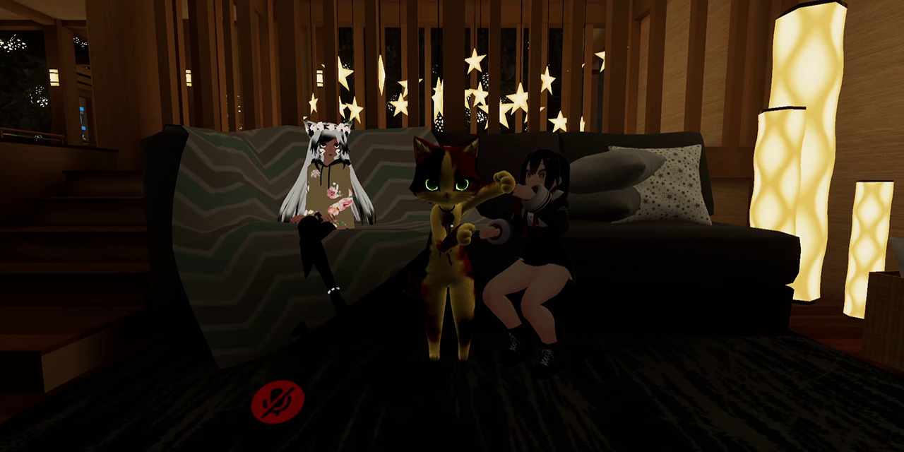

# Avatar Limbs Grabber
MelonLoader mod for VRChat that brings limbs manipulation of local player by remote players.

# Installation
* Install [latest MelonLoader](https://github.com/LavaGang/MelonLoader)
* Install [latest UIExpansionKit](https://github.com/knah/VRCMods)
* Install [latest VRChatUtilityKit](https://github.com/SleepyVRC/Mods)
* Get [latest release DLL](../../../releases/latest)
* Put `ml_alg.dll` in `Mods` folder of game

# Usage
## Settings
Available mod's settings through UIExpansionKit:
* **Maximal distance to limbs:** maximal distance to limbs for successful grab, 0.25 by default.
* **Allow friends to manipulate you:** allow manipulation for friends in room (includes new joiners and option toggle), enabled by default.
* **Allow pull:** allow pulling head grab, enabled by default.
* **Allow hands pull:** allow hand limbs pulling, enabled by default.
* **Allow hips pull:** allow hips pulling, enabled by default.
* **Allow legs pull:** allow leg limbs pulling, enabled by default.
* **Preserve manipulated pose:** lock manipulated limbs upon grab release, disabled by default.
* **Apply velocity on pull:** enable throwing upon releasing head grab, disabled by default.
* **Velocity multiplier:** throwing velocity multiplier, 5.0 by default.
* **Use average velocity:** average velocity calculation for throwing, enabled by default.

## Menu
* Select player in quick menu.
* Press `Allow limbs manipulation` in UIExpansionKit quick menu.

Also, available additional `Avatar limbs grabber` menu button in main UIExpansionKit quick menu tab:
* **World pull permission:** shows if pulling head grab is allowed in this world.
* **Reset manipulated pose:** reset manipulated pose if `Preserve manipulated pose` option is enabled.
* **Disallow manipulation for everyone in room:** remove manipulation from everyone in room.

## Functionality
To succesfully grab your limbs remote player should place his hand near your avatar bone and hold fist gesture (applied for desktop and VR).  
Index users should enabled gestures from action menu settings.

# Notes
* [IKTweaks](https://github.com/knah/VRCMods) support is removed due to several issues after release tag [`r51`](https://github.com/SDraw/ml_mods/tree/r51).
* You can't be picked up in worlds that don't allow risky functions.
* Shame on you for using it in ERP.
