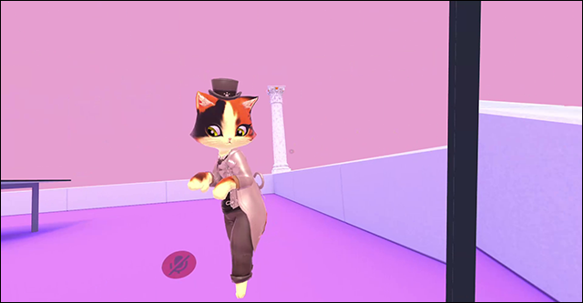

# Head Turn
MelonLoader mod for VRChat that allows to turn head regardless of body rotation. Slightly similar to ChilloutVR head turning.

# Installation
* Install [latest MelonLoader](https://github.com/LavaGang/MelonLoader)
* Install [latest VRChatUtilityKit](https://github.com/SleepyVRC/Mods)
* Get [latest release DLL](../../../releases/latest):
  * Put `ml_ht.dll` in `Mods` folder of game

# Usage
* Hold `Left Alt` to lock body rotation.
  * Use `Mouse wheel` to roll your head.
  * Hold `Left Control` to ignore rotation limits.
