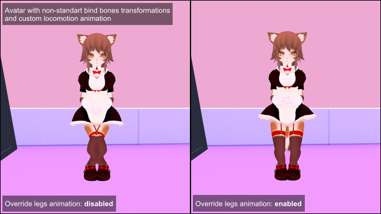

# Legs Animation Tweaker
MelonLoader mod for VRChat that allows to override functionality of legs IK on avatars.  
Designed primarily for avatars that have non-standart bones bind poses and custom locomotion animations that resulting wrong legs directions upon IK tracking.

# Installation
* Install [latest MelonLoader](https://github.com/LavaGang/MelonLoader)
* Install [latest VRChatUtilityKit](https://github.com/SleepyVRC/Mods)
* Get [latest release DLLs](../../../releases/latest):
  * Put `ml_lat.dll` in `Mods` folder located in VRChat's folder

# Usage
## Settings 
Available mod's settings through UIExpansionKit:
* **Override legs animation:** disables animation affection for legs IK computing if enabled, disabled by default.
* **Override legs autostep:** disables legs autostep if enabled, disabled by default.
* **Override knees direction:** forces knees direction to player's forward direction if enabled, disabled by default.
