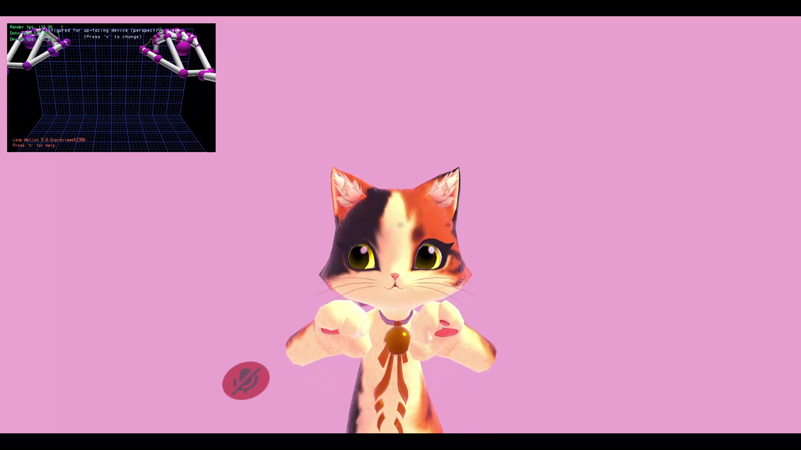

# Leap Motion Extension
This mod allows you to use your Leap Motion controller for hands and fingers visual tracking.

# Installation
* Install [Orion (v4)](https://developer.leapmotion.com/sdk-leap-motion-controller) or [Gemini (v5)](https://developer.leapmotion.com/gemini-v5-preview).
* Install [latest MelonLoader](https://github.com/LavaGang/MelonLoader).
* Install [latest VRChatUtilityKit](https://github.com/loukylor/VRC-Mods)
* Install [UIExpansionKit](https://github.com/knah/VRCMods) (highly recommended).
* Get [latest release DLL](../../releases/latest).
* Put `ml_lme.dll` in `Mods` folder of game.

# Usage
Check self-explanatory mod settings in UIExpansionKit's mods settings tab.

# SDK3 avatars parameters
You can retrieve hands presense, fingers curls and spreads by setting specific parameters in your avatar.  
List of available additional parameters:
* `_LeftHandPresent` - boolean
* `_RightHandPresent` - boolean
* `_LeftHandThumbBend` - float
* `_LeftHandIndexBend` - float
* `_LeftHandMiddleBend` - float
* `_LeftHandRingBend` - float
* `_LeftHandPinkyBend` - float
* `_LeftHandThumbSpread` - float
* `_LeftHandIndexSpread` - float
* `_LeftHandMiddleSpread` - float
* `_LeftHandRingSpread` - float
* `_LeftHandPinkySpread` - float
* `_RightHandThumbBend` - float
* `_RightHandIndexBend` - float
* `_RightHandMiddleBend` - float
* `_RightHandRingBend` - float
* `_RightHandPinkyBend` - float
* `_RightHandThumbSpread` - float
* `_RightHandIndexSpread` - float
* `_RightHandMiddleSpread` - float
* `_RightHandRingSpread` - float
* `_RightHandPinkySpread` - float

# Notes
* In desktop mode be sure to disable gestures in "Action Menu (R) - Options - Gestures" to make avatar animation actions be in fixed state instead of on hold state.
* Offset values correspond to SteamVR environment units.
* Usage of mods breaks ToS of VRChat and can lead to ban. Use at your own risk.

# Credits
* Thanks to [Magic3000](https://github.com/Magic3000) for patch to enable remote finger tracking in VR mode.
