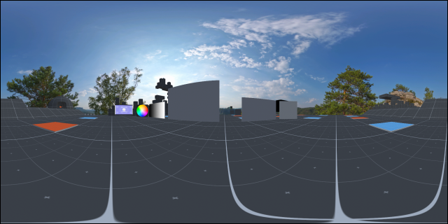

# Panorama Screenshot
This mod recreates removed panoramic screenshots feature with configurable options.

# Installation
* Install [latest MelonLoader](https://github.com/LavaGang/MelonLoader)
* Install [latest VRChatUtilityKit](https://github.com/SleepyVRC/Mods)
* Install [latest UIExpansionKit](https://github.com/knah/VRCMods)
* Get [latest release DLL](../../../releases/latest)
* Put `ml_ps.dll` in `Mods` folder of game

# Usage
New buttons available in quick menu camera tab:
* **Panorama (main):** gets panoramic screenshot from player view point (desktop and VR).
* **Panorama (stream):** gets panoramic screenshot from stream camera view point (only VR), follows portable camera's world anchoring.

Available mod's settings through UIExplansionKit:
* **Ignore local player:** don't render local player's avatar on screenshots, enabled by default.
* **Ignore players:** don't render remote players' avatars on screenshots, enabled by default.
* **Ignore UI:** don't render UI elements on screenshots, enabled by default.
* **Cubemap size:** size of each cubemap texture face as first rendering iteration, 1024 by default.
* **Panorama width:** width of output image of panoramic screenshot as second rendering iteration, 2048 by default.
* **Panorama height:** width of output image of panoramic screenshot as second rendering iteration, 1024 by default.

All panoramic screenshots are saved to `%USERPROFILE%/Pictures/VRChat/Panorama`.

# Notes
* Mirrors aren't rendered right, consider to disable them manually before taking panoramic screenshots.
* High cubemap and panorama sizes consume large amount of VRAM.

# Credits
* Thanks to [Killers0992](https://github.com/Killers0992) for this crazy idea.
* Thanks to [cxaiverb](https://github.com/cxaiverb) for world name output idea from his mod variant.
